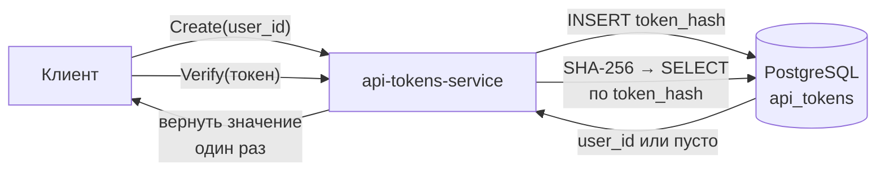

# api-tokens-service

gRPC-сервис выпуска и проверки API-токенов для системы видеохостинга. Токен
нужен, чтобы обращаться к видео по HTTP без браузерной сессии.

Контракт: [grpc-contract](https://github.com/nikaydo/grpc-contract) ·
потребитель: [video-platform](https://github.com/nikaydo/video-platform)

## Что делает

| Метод | Назначение |
|---|---|
| `Create` | Выпускает токен для пользователя. Возвращает значение **один раз** |
| `Delete` | Отзывает токен. Требует идентификатор владельца |
| `Get` | Возвращает хеши токенов пользователя |
| `Verify` | Проверяет токен. Недействительный — `result = false`, не ошибка |

## Стек

Go 1.24 · gRPC · PostgreSQL 17 (`pgx/v5`) · `golang-migrate` · `caarlos0/env` ·
slog · Docker · GitHub Actions

## Запуск

```bash
git clone https://github.com/nikaydo/api-tokens-service.git
cd api-tokens-service

# 1. Конфигурация
cp .env.example .env
# Заполнить DATABASE_URL

# 2. Запуск
docker compose up --build
```

Сервис поднимается на `localhost:50052`, миграции применяются при старте.

## Конфигурация

| Переменная | По умолчанию | Назначение |
|---|---|---|
| `DATABASE_URL` | — | Строка подключения к PostgreSQL |
| `HOST` / `PORT` | `0.0.0.0` / `50052` | Адрес gRPC-сервера |
| `MAX_MESSAGE_BYTES` | `1048576` | Предел размера входящего сообщения |
| `MAX_TOKENS_PER_USER` | `10` | Сколько токенов может быть у пользователя |
| `SHUTDOWN_TIMEOUT` | `30s` | Ожидание завершения запросов при остановке |

Приложение не запускается со значением-заглушкой `CHANGE_ME` или шаблоном
`DATABASE_URL` из `.env.example`.

## Как устроен токен



Токен — случайная строка `vpt_` + 43 символа base64url (32 байта энтропии).
В базе хранится **только SHA-256 хеш**.

*Почему хеш:* утечка базы не даёт воспользоваться чужим токеном — сам токен
ещё нужно предъявить.

*Почему не JWT:* у токена нет утверждений, которые нужно проверять. Единственный
способ его принять — найти запись по хешу. 256 бит энтропии делают перебор
невозможным, поэтому медленный KDF не нужен.

*Почему значение показывается один раз:* сервер его не хранит и отдать не
может. При утрате нужно выпустить новый токен.

## Решения и их цена

### Проверка владельца

`DeleteRequest` и `GetRequest` требуют `user_id`, и он участвует в условии
запроса:

```sql
DELETE FROM api_tokens WHERE user_id = $1 AND token_hash = $2
```

Раньше удаление шло по одному значению токена без проверки владельца, поэтому
любой мог отозвать чужой токен. Токенов чужого пользователя также нельзя было
получить — `ListByUser` фильтрует по `user_id`.

*Цена:* вызывающий обязан знать свой `user_id` и передавать его. В контракт
добавлено поле `user_id`, которого раньше не было.

### Хеш сравнивается в Go, а не в SQL

`Verify` не передаёт хеш в запрос и не сравнивает его в SQL. Иначе значение
попало бы в план запроса, а при включённом `log_min_duration_statement`
 PostgreSQL — в журнал медленных запросов.

*Цена:* сравнение выполняется на стороне сервиса, поэтому индекс по хешу всё
равно используется для поиска, а не для сравнения.

### Формат токена проверяется до базы

`Verify` отсекает значения, не похожие на выпущенные, ещё до обращения к базе.
Без этой проверки запрос с произвольной строкой приводил бы к полному
просмотру таблицы.

*Цена:* формат токена — часть контракта этого сервиса. Смена префикса или
длины потребует синхронного изменения всех выпущенных токенов.

### Предел токенов на пользователя

`MAX_TOKENS_PER_USER` защищает таблицу от одного клиента, который выпускает
токены в цикле.

*Цена:* ограничение жёсткое — при его достижении приходится удалять старые
токены вручную.

### Недействительный токен — не ошибка

`Verify` возвращает `result = false`, а не ошибку gRPC. Отсутствие токена не
является сбоем сервиса, и шлюзу не приходится различать два случая обработки
одного ответа.

*Цена:* вызывающий обязан проверять поле `result`. Раньше шлюз его проверял,
но пропускал пустой токен из формы.

## Тесты

```bash
task test              # модульные, с -race
task test:integration  # нужен TEST_DATABASE_URL
task cover             # отчёт о покрытии
```

Интеграционные тесты проверяют, что токен не хранится открытым текстом и что
чужой токен нельзя удалить или увидеть в списке. Без `TEST_DATABASE_URL` они
пропускаются, в CI PostgreSQL поднимается сервисом.

## Ограничения

- Нет срока действия и отзыва по времени: токен живёт, пока не удалён
- Нет привязки к конкретному ресурсу: токен открывает доступ ко всем видео пользователя
- Нет ограничения частоты `Create`: предел только на количество токенов

## Лицензия

MIT — см. [LICENSE](LICENSE).